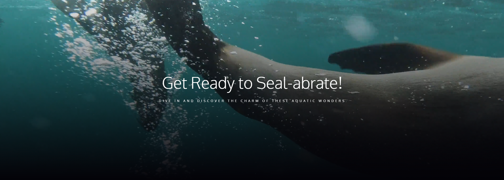

# 🌊 Seal World

> Projeto de uma página sobre focas, onde temos seções de **exploração do mundo das focas**, **estilos e movimentos**, **pontos de encontro das focas**, **galeria da tripulação** e **fatos interessantes**. Este projeto veio do curso da OneBitCode!

## 📸 Imagem do Projeto


## 🛠️ Tecnologias Utilizadas
- HTML5
- CSS3 (incluindo imagens, vídeos, positions, display, entre outros)

## 📦 Como visualizar o projeto localmente  
```bash
# Clone o repositório
git clone https://github.com/fcdias0812/Seal_World.git

# Acesse a pasta do projeto
cd Seal_World

# Abra o arquivo index.html no navegador
```

## 🎯 Aprendizados
Esse projeto me ajudou a consolidar conceitos, podendo praticar os mesmos
✔️ **::after** para criar pseudoelementos
✔️ **display: inline-block** para ajudar no posicionamento
✔️ **object fit e position** para posicionar melhor as imagens e vídeo

## 📞 Contato  
📧 Email: dias.fabricio0812@gmail.com  
💼 LinkedIn: [Acesse meu LinkedIn](https://www.linkedin.com/in/fcdias0812/)